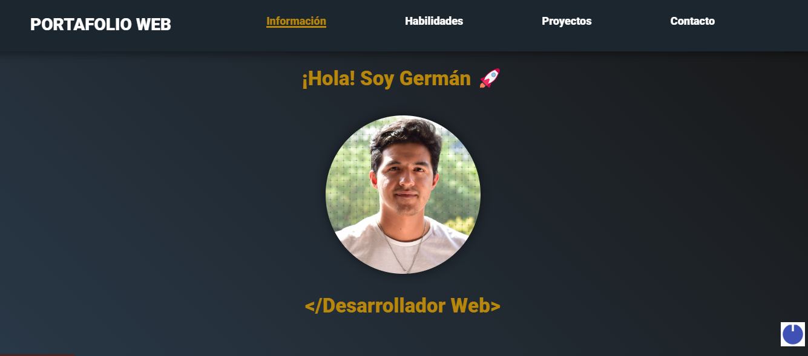

# Mi Portafolio Web
Espacio para mostrar mi perfil personal: Proyectos, Experiencia, Habilidades, Contacto y mucho más

## Autor

[@germope5](https://www.linkedin.com/in/germope5/)

## WebSite de Prueba

Una demostración del Portafolio Web corriendo en un domionio.

## Tech Stack

**Cliente:** HTML, CSS, Vanilla JavaScript

## Herramientas utilizadas
En la parte de abajo se encuentra un listado de las herramientas que utilicé para construír el portafolio,
y las funciones que realice con cada una de ellas.

- [Ion Icons](https://ionic.io/ionicons) Para el menú de barra de Hamburguesa.
- [Drawkit](https://www.drawkit.io/) Para las ilustraciones e imágenes en el portafolio.
- [Icon8](https://icons8.com/) Para los íconos animados y los íconos de habilidades.
- [Animate CSS](https://animate.style/) Para la biografía animada de texto sobre mí.
- [Formspree](https://formspree.io/) Para envío de formulario de contacto y entrega directa a Gmail

## Estructura de Carpetas

El archivo index.html y el README se encuentran en la rutra principal del proyecto, junto a la captura de pantalla de la página principal del portafolio.

La carpeta "assets" contiene los archivos CSS y los archivos de Javascript, todas las imágenes e íconos utilizados, en sus respectivas carpetas.

## Agradecimientos

- [Awesome Readme Templates](https://awesomeopensource.com/project/elangosundar/awesome-README-templates)
- [koladechris](https://github.com/Ksound22/developer-portfolio)
